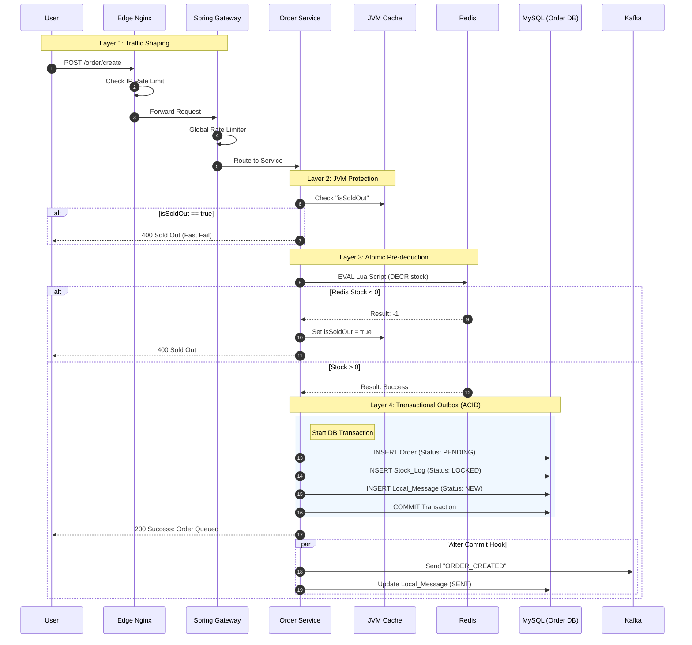
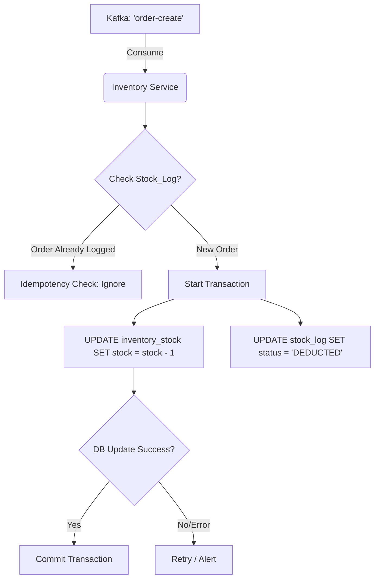
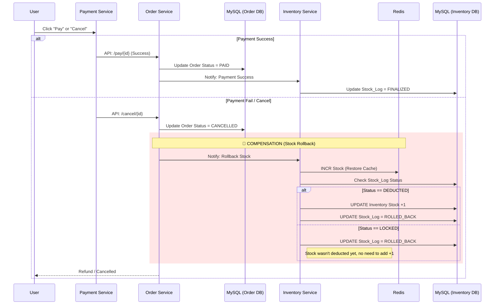
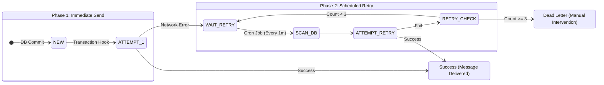

# 📊 System Flowcharts

## 1. High-Concurrency Order Creation

This flow handles the initial user request. The goal is to return a response as fast as possible while preventing overselling, offloading the heavy DB write to a background thread.

---

## 2. Asynchronous Inventory Sync (The Consumer)

This process runs in the background in the `Inventory Service`. It ensures the MySQL inventory eventually matches the Redis inventory.

---

## 3. Payment Flow & Compensation (Rollback)

This flow handles the user interaction *after* the order is created. It demonstrates the **Saga Pattern** (Compensation) where a failure triggers a reverse operation.

---

## 4. Local Message Retry (Reliability)

A scheduled task ensures that even if the Kafka send fails (network glitch), the message is eventually sent.

